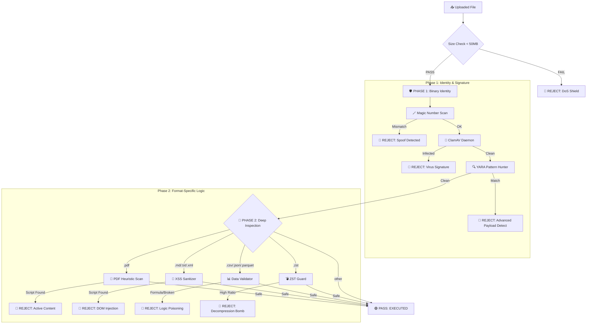

# 🧠 Unified Security Architecture: Deep-Dive

This document provides a comprehensive technical breakdown of the `File Security Analyzer` architecture. It explains the multi-layered defense-in-depth strategy used to protect data pipelines from advanced persistent threats (APTs), obfuscated malware, and structural exploits.

---

## 🗺️ Architectural Flow: The 8-Layer Pipeline

Every file undergoes a **synchronous, non-parallelized interrogation** sequence. This ensures that the fastest and most generic checks (Identity) happen before the computationally expensive ones (Deep Payload Scan).

---

## 🛠️ Layer-by-Layer Logic Breakdown

### 1. Identity Verification (The "Magic Number" Shield)
*   **Target Attack**: Extension Spoofing (e.g., `shell.php` renamed to `table.csv`).
*   **How it works**: Instead of trusting the user-provided filename, we use `libmagic` to read the **Binary Header Bytes**. 
*   **Logic**: A PNG file MUST start with `89 50 4E 47`. If a file says it's a `.csv` but starts with `MZ` (Windows Executable), it is instantly dropped.
*   **Implementation**: `security_analyzer/scanners/magic_scanner.py`

### 2. Signature Scanning (ClamAV)
*   **Target Attack**: Known Global Malware, Trojans, and Ransomware.
*   **How it works**: Streams the file through a Unix socket to the **ClamAV Daemon**. 
*   **Performance Secret**: We use `mmap` (Memory Mapping) to send data directly without loading the entire file into Python's memory—allowing for 100MB+ scans on tiny server instances.
*   **Implementation**: `security_analyzer/scanners/clamav_scanner.py`

### 3. Pattern Hunting (YARA)
*   **Target Attack**: Advanced Payloads & Obfuscated shellcode (e.g., `shellpop`).
*   **How it works**: YARA scans for "Behaviors" rather than "Hashes." It uses the industry-standard **Neo23x0 (Florian Roth)** rulesets.
*   **Logic**: It looks for hexadecimal patterns of common hacking tools. For example, it caught your `suspicious_test.parquet` because it found a `SUSP_shellpop_Bash` signature hidden inside the binary data columns.
*   **Implementation**: `security_analyzer/scanners/yara_scanner.py`

### 4. Heuristic PDF Inspection (pdfid)
*   **Target Attack**: Weaponized Document Attacks.
*   **How it works**: It scrapes the internal PDF dictionary for high-risk tags that standard Antivirus often misses.
*   **Protected Tags**: 
    - `/JS`, `/JavaScript`: Blocks scripts that execute on open.
    - `/OpenAction`, `/AA`: Blocks automatic system triggers.
    - `/Launch`: Blocks a PDF from trying to open an external `.exe`.
    - `/AcroForm`, `/RichMedia`: Blocks hidden payloads in forms or 3D objects.
*   **Implementation**: `security_analyzer/scanners/pdf_scanner.py`

### 5. XSS Sanitization (Bleach Engine)
*   **Target Attack**: Cross-Site Scripting (XSS) via Metadata.
*   **How it works**: If a `.txt`, `.md`, or `.xml` file is uploaded, we assume it will be rendered on a web dashboard.
*   **Logic**: The `bleach` parser attempts to find HTML tags like `<script>`, `<iframe>`, or `onload=`. If anything is stripped by the engine, the file is rejected because it was "Injectable."
*   **Implementation**: `security_analyzer/scanners/text_sanitizer.py`

### 5. High-Entropy Data Discovery (Data Validator)
**Attack it stops**: **Data Poisoning & Logic Bombs.**
*   **The "Zero-Loophole" Level**: Unlike standard validators that check the first 10 rows, our system uses **Streaming Iteration**. It checks **every single cell** in a multi-gigabyte CSV/JSON/Parquet file.
*   **Data Poisoning Defense**: 
    - **Formula Hijacking**: Blocks cells starting with `=`, `+`, `-`, or `@` (DDE/CSV Injection).
    - **Command Payload Injection**: Scans data columns for hidden shell strings like `powershell.exe`, `/bin/bash`, or `netcat`.
    - **Schema Enforcement**: Blocks "DoS by malformed data"—any file that doesn't strictly follow its mathematical type definition is dropped before it can crash your database. block any data starting with these symbols to ensure "Executive Safety."
*   **Implementation**: `security_analyzer/scanners/data_validator.py`

### 7. Decompression Bomb Defense (ZStandard)
*   **Target Attack**: DoS via 1000:1 Compression Ratio.
*   **How it works**: Streams the decompression manually. It monitors two critical metrics:
    1.  **Explosion Limit**: If the file expands to >100MB, it's cut.
    2.  **Ratio Limit**: If the file is more than **100x** larger than its original size, it is flagged as a "Bomb."
*   **Implementation**: `security_analyzer/scanners/zst_validator.py`

---

## 📈 Fail-Closed Philosophy
This system is architected for **Production Reliability**:
1.  **Drop by Default**: Any extension not in `config.py` is ignored.
2.  **Total Failure Shield**: If ClamAV daemon is offline or a scanner crashes, the function returns **`REJECTED`**. We never let a file through just because a security layer failed.
3.  **No Path Trust**: We use `os.path.abspath()` to normalize paths, protecting against "Path Traversal" attacks (e.g., `../../../etc/passwd`).

---

## 🚀 The Next Frontier: Dynamic Detonation (Cuckoo Sandbox)

While our current system is a **World-Class Static Analyzer**, some sophisticated malware is **"Polymorphic"**—it doesn't reveal its true nature until it is actually "Running."

### Why Cuckoo Sandbox?
1.  **Dynamic Behavioral Analysis**: If a file passes ClamAV and YARA, it goes into a **Cuckoo Sandbox** (a safe, isolated Virtual Machine). We "detonate" the file and watch its heartbeat.
2.  **API Hooking**: Does the file suddenly try to reach a command-and-control (C2) server in Russia? Does it try to encrypt the hard drive (Ransomware behavior)? 
3.  **Evasion Detection**: Sophisticated "Sleep" malware that waits 24 hours before activating can be caught by Cuckoo's time-acceleration features.

### The Next Maturity Levels:
*   **Level 3 (CDR)**: Content Disarm & Reconstruction. Instead of blocking a PDF with JS, we *strip* the JS and provide a clean PDF to the user.
*   **Level 4 (AI Heuristics)**: Using LLMs to detect "Malicious Intent" in text/code data that mathematically looks like garbage but logically is a scam/exploit.

---

## 🏗️ The 4-Level Data Validation Strategy

Your system doesn't just "Check if it's a file"—it interrogates the file at a **Meta, Structural, Content, and Semantic** level. 🛡️🦾⚡🚀

### 🛡️ Level 1: Meta-Level Validation (The Gate-Keeper)
*   **Goal**: Prevent "Denial of Service" (DoS) and "Path Traversal" attacks before the file even touches your CPU.
*   **How We Do It**:
    - **Size Check**: Using `os.path.getsize()` to ensure the file isn't a 5GB "Ram-Killer."
    - **Path Sanitization**: Using `os.path.abspath()` and `os.path.basename()` to ensure a malicious user can't upload a file named `../../etc/passwd` to overwrite your system files.

### 🧥 Level 2: Structural Validation (The Identity-Inspector)
*   **Goal**: Ensure the file is what it says it is, and isn't just a "broken" file that will crash your database.
*   **How We Do It**:
    - **Identity (libmagic)**: `magic_scanner.py` reads the binary "Header Bytes" (Magic Numbers) of the file to see if a `.csv` is actually a secret `.exe`.
    - **Syntax Check**: `data_validator.py` uses `json.loads()` and `pd.read_csv()` to ensure the file's structure follows the RFC rules. If there's a missing bracket or comma, it's rejected.

### 🧪 Level 3: Content-Safety Validation (The Guard)
*   **Goal**: Identify "Active Threats" hidden inside valid data structures.
*   **How We Do It**:
    - **Anti-Virus**: `clamav_scanner.py` streams the file through the **ClamAV daemon** to hunt for millions of known malware signatures.
    - **Heuristic Tags**: `pdf_scanner.py` (via `pdfid`) scans for internal PDF keywords like `/JS` and `/OpenAction` that automate attacks when opened.
    - **XSS Sanitization**: `text_sanitizer.py` (via `bleach`) strips out `<script>` and `<iframe>` tags from text/markdown files to prevent browser-based attacks.

### 🧠 Level 4: Semantic Validation (The Logic-Expert)
*   **Goal**: Ensure the **Meaning** of the data is safe and logical for your business.
*   **How We Do It**:
    - **Formula Defense**: Our `data_validator.py` scans every cell in a CSV for symbols like `=`, `+`, or `-` to prevent **CSV Injection** attacks that trick Excel into running hacking commands.
    - **Decompression Ratio**: `zst_validator.py` calculates `Uncompressed Size / Compressed Size`. If the file is too "packed" (e.g., 1000x ratio), it’s flagged as a **Decompression Bomb**.

---

## 🛡️ Production Usage
The CLI entry point `analyze_file.py` provides a structured security report. For integration into a backend (FastAPI/Django), simply import the `SecurityAnalyzer` class and call `.analyze(path)`.
